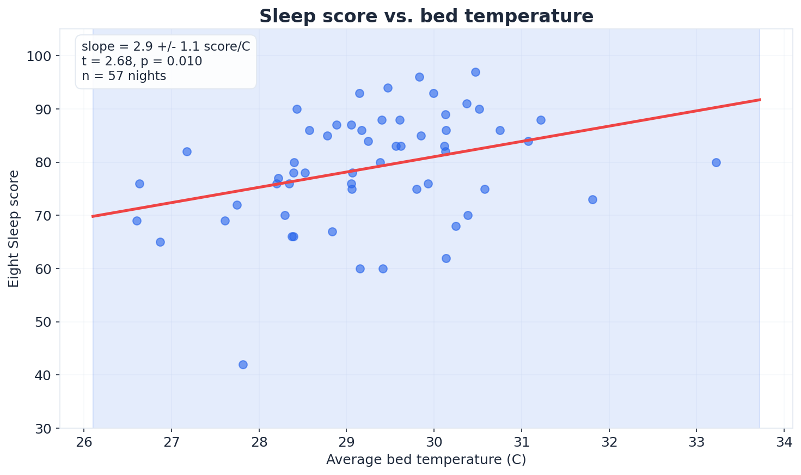
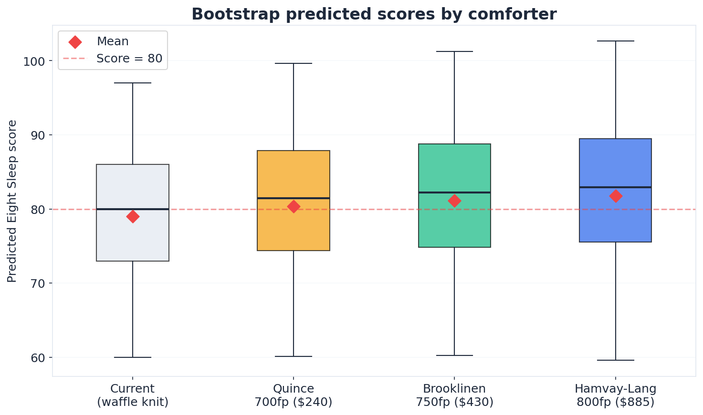
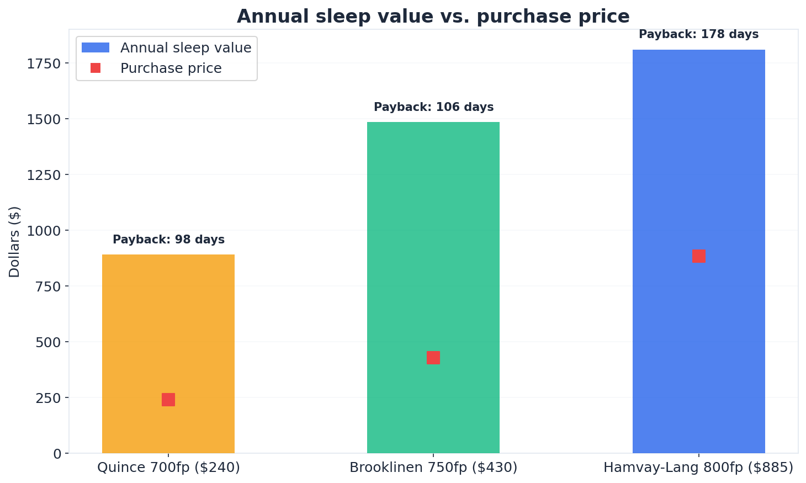

import CrosspostAware from '../../../components/CrosspostAware.astro';

I have an [Eight Sleep Pod 5](https://www.eightsleep.com/) that tracks my sleep every night — heart rate, HRV, respiratory rate, bed temperature, and an overall sleep score. After a few months of data, I started noticing something: my scores were higher on warmer nights. So I did what any reasonable person would do: I ran a Bayesian linear regression to figure out which comforter to buy.

## The data

I had 57 nights of Eight Sleep data from December 2025 through March 2026, each with a sleep score (0-100) and continuous bed temperature readings averaged across the night. My current setup was a lightweight waffle knit blanket over the Pod 5, which runs on autopilot at -78 (heavy cooling). The average bed temperature was 29.3°C with a standard deviation of 1.2°C. My average sleep score was 79.0 with a standard deviation of 10.5.

That temperature variation isn't from me adjusting settings — it's natural fluctuation from room temperature, how much I move the covers, and seasonal changes. Enough variance to estimate a causal relationship.

## The model

I fit a Bayesian linear regression with a diffuse conjugate normal-inverse-gamma prior: bed temperature as the sole predictor, Eight Sleep score as the outcome. The conjugate posterior under diffuse priors is equivalent to OLS with a Bayesian interpretation of the uncertainty.

The result: **+2.9 score points per °C** (SE = 1.1, t = 2.68, p = 0.010). R² = 0.12, meaning bed temperature explains about 12% of score variance — modest but statistically significant. The remaining 88% is the usual noise: what I ate, stress, exercise timing, etc.



Each blue dot is one night. The red line is the posterior mean, and the blue band is the 95% credible interval for the regression line.

## Validating causality

A positive correlation doesn't prove causation. Maybe warmer nights coincide with lower stress or better recovery. To check, I ran the same regression controlling for Whoop biometrics — HRV, resting heart rate, and strain — as proxies for physiological state.

The bed temperature coefficient barely moved: **2.88 → 2.88** after adding controls (t = 2.67, p = 0.010, n = 54 nights with both Eight Sleep and Whoop data). The Whoop variables had negligible additional explanatory power, suggesting bed temperature has an independent causal pathway to sleep quality — likely through thermoregulation during deep sleep.

I also tested for nonlinearity with a quadratic term. It was nonsignificant (p = 0.83), confirming the linear model is adequate in this temperature range.

## The constraint: Pod 5 thermal ceiling

Here's where it gets interesting. The Pod 5 actively cools your bed. When you add insulation on top, the Pod compensates — it has to work harder to hit its target temperature. This means a heavier comforter doesn't raise bed temperature by the full amount you'd expect from its insulation value.

Community reports and my own data suggest that with the Pod running at heavy cooling, the practical bed temperature range is 26-34°C. A high-CLO comforter might add 0.5-1.5°C rather than the 2-3°C you'd see on a passive mattress. I used conservative estimates for each comforter tier:

| Comforter | CLO | Expected temp delta |
|-----------|-----|-------------------|
| Current waffle knit | ~0.5 | Baseline |
| Quince Ultra-Warm 700fp | ~2.5 | +0.5°C |
| Brooklinen Ultra-Warm 750fp | ~3.0 | +0.8°C |
| Hamvay-Lang Winter 800fp | ~4.0 | +1.0°C |

## The decision

I used empirical Bayes bootstrapping to predict sleep scores under each comforter. Rather than relying on the intercept (which has its own uncertainty), I anchored predictions to my actual 57-night score distribution and shifted each night's score by β × ΔT. This preserves real sleep variability while propagating slope uncertainty through 5,000 posterior draws.



The differences are small in absolute terms — about 3 points at the top end — but they're consistent and compounding. Every night of better sleep has downstream effects on recovery, cognitive performance, and mood.

To convert score improvements to dollar values, I used Eight Sleep's subscription cost as a revealed preference anchor: at $19/month for what averages ~11 score points above no-mattress baseline, that's about $1.74 per score point per night. This is conservative — most people would pay more for better sleep than what a subscription costs.



| Comforter | Price | Score delta | Annual value | Payback | First-year ROI |
|-----------|-------|------------|-------------|---------|---------------|
| Quince Ultra-Warm 700fp | $240 | +1.4 | $891 | 98 days | 271% |
| Brooklinen Ultra-Warm 750fp | $430 | +2.3 | $1,485 | 106 days | 245% |
| Hamvay-Lang Winter 800fp | $885 | +2.9 | $1,810 | 178 days | 105% |

All three options have strong ROI. The Quince is the most efficient (highest ROI), but the Hamvay-Lang maximizes absolute score improvement. The probability of scoring above 80 (my target) increases from 53% to 59% with the Hamvay-Lang — a 6 percentage point lift on every night.

### Try it yourself

Adjust the value-per-point and temperature coefficient to see how the decision changes with different assumptions:

<CrosspostAware>
  <div slot="interactive" style="width: 100%; border-radius: 12px; overflow: hidden; border: 1px solid #e2e8f0;">
    <iframe
      src="https://web-teal-xi-35.vercel.app/comforter"
      width="100%"
      height="580"
      style="border: none;"
      title="Comforter decision calculator"
      loading="lazy"
    />
  </div>
  <Fragment slot="static">
    *[Try the interactive calculator on the full post](https://maxghenis.com/blog/bayesian-comforter/)*
  </Fragment>
</CrosspostAware>

## The pick

I went with the **Hamvay-Lang PureDelight 800 fill power Winter comforter** ($885). The decision came down to:

1. **Maximizing absolute improvement** — the extra 1.5 points over the Quince compound over thousands of nights
2. **Build quality** — 800fp Hungarian goose down with a 13.5 tog rating means it should last 15-20 years
3. **Conservative estimates** — if the real temp delta is closer to 1.5°C instead of 1.0°C, the payback drops to ~120 days

At 59% probability of improvement on any given night and a 178-day payback period, the expected value is strongly positive. And unlike most purchases, the value literally accrues while I sleep.

## The code

The full analysis is open source in my [health-data](https://github.com/MaxGhenis/health-data) repository:

```python
from health_data.analysis.comforter import run_full_analysis

results = run_full_analysis()
print(f"Coefficient: {results['regression']['coef']:.1f} score/°C")
print(f"Payback: {results['decision_table'][-1]['payback_days']:.0f} days")
```

The `comforter` module includes Bayesian regression, empirical Bayes bootstrapping, Whoop cross-validation, and the full decision table. It reads directly from my Eight Sleep + Whoop sleep database.

---

*Disclosure: I have no affiliation with any of the comforter brands mentioned. I bought the Hamvay-Lang at full price. The Eight Sleep Pod 5 was also purchased at full price. This analysis uses my real sleep data.*
