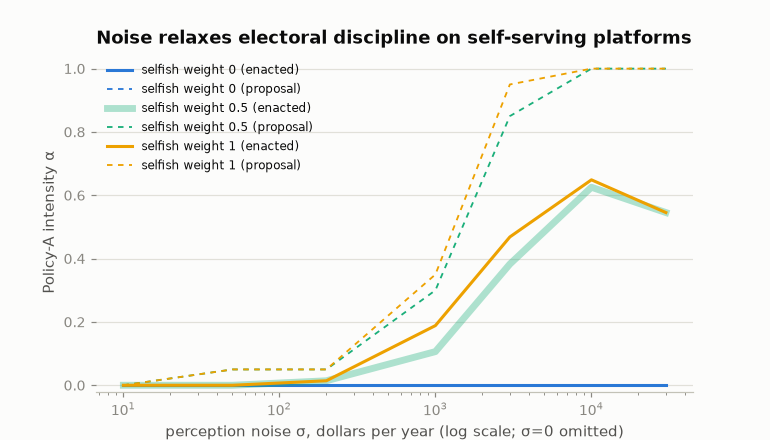
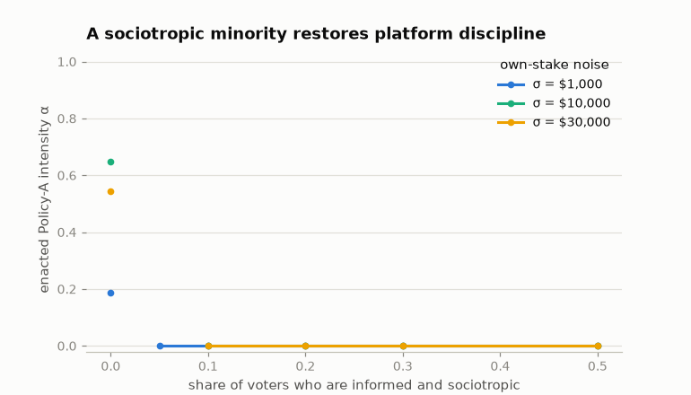

import DemocrasimExplorer from '../../components/DemocrasimExplorer.tsx';

Do elections pick the policy that's better for people when voters
misperceive what policies would do to them? Models of that question
usually invent the decisive input: who stands to gain how much.
[Democrasim](https://github.com/MaxGhenis/democrasim) measures it.

- **The electorate is 120,408 voting-age adults** from PolicyEngine's
  certified, population-calibrated microdata, representing 268 million
  people. (I co-founded PolicyEngine; this is a personal project using its
  open data and models.)
- **The two platforms are actual encoded reforms** with opposite
  incidence, labeled generically. Policy A raises the child tax credit's
  base amount from $2,200 to $3,200. Policy B caps the top two marginal
  income tax rates at 34%. The tax engine scores them at $39.1B and
  $38.0B a year of household net income — matched within 3%, so neither
  is simply the bigger giveaway.
- **Each voter's true stake is engine-computed**: their household's
  change in annual net income under each policy, including knock-on
  effects through other taxes and benefits. A per-adult levy finances
  each policy, so both are budget-neutral, and an inequality-averse
  welfare metric (log utility) ranks A above B.
- **Perception is the one assumption.** Each voter sees their own stake
  plus Gaussian noise σ, plus an optional shared bias — the knob the
  model turns, and the thing a survey could measure but nobody has.

Voters vote for whichever policy looks better for their household, by
plurality. The question is how often the election picks the
welfare-preferred policy.

## What people actually have at stake

Gross of financing, 76% of adults see approximately $0 from both
policies. Policy A's gains arrive in per-child steps — $1,000, $2,000,
$3,000 — for the 20% of households with eligible children. Policy B
sends 99.7% of its dollars to the top income decile. Once financing
enters, the three-quarters with no direct stake inherit a margin of a
few dollars: the two levies differ by $4.10 per adult per year, so 75%
of adults have less than $25 a year riding on the outcome while a fifth
have more than $500.

The figure's two synthetic worlds are what election models typically
assume — a Gaussian world matched to the measured moments, and a world
where every voter holds the average stake. Neither has the measured
shape: a nearly indifferent mass of three in four, and a small bloc with
thousand-dollar stakes. That shape drives everything below.

## Try it

The model reduces to closed-form math (each voter votes A with
probability Φ((margin − bias)/σ√2)), so this page runs the real thing in
your browser, on the real margins:

<DemocrasimExplorer client:load />

Three settings worth trying:

1. **Perfect information** (σ = $0). Policy B wins 100% of elections —
   the opposite of the welfare ranking. The 76% of adults whose entire
   stake is the $4.10 levy difference vote their four dollars, and
   together with the 3% who gain from the rate cap they outnumber the
   fifth of adults in households with children.
2. **Moderate noise** (σ = $1,000). Policy A wins essentially 100% of
   the time. Noise turns the four-dollar voters into coin flips that
   cancel, and the informed minority with per-child-sized stakes decides.
   In this regime, misperception helps.
3. **Shared bias** ($300 toward B, at the same σ = $1,000). The election
   flips back to B. About $221 per voter per year of shared misperception
   undoes what $1,000 of independent noise cannot touch.

## The knife-edge

At σ = 0 the outcome rests entirely on the *sign* of the $1.1B residual
cost gap between the two policies — a byproduct of budget-matching them
within 3%, with no connection to which policy the welfare metric
prefers. Switch the explorer to the counterfactual world where Policy B
costs 3% more instead of 3% less: perfect information now elects A every
time, same mechanism, opposite verdict. Perfect information makes the
election welfare-independent, handing the decision to whichever side of
an arbitrary residual the no-stakes mass lands on.

The mass only rules while it votes. In the gross world (no financing),
its stake is exactly $0, it abstains under the model's
indifference-abstains rule, and perfect information tracks perfectly on
24% turnout. A $25 abstention band does the same. Approval voting does
it too, from the other direction: voters who see both policies as small
net losses approve neither, and A wins at perfect information on 23%
turnout. Elections count people, not dollars — so whether the
trivial-stakes majority shows up decides everything, and that is a
behavioral question the model can't answer.

## Scale moves the thresholds

The tracking window at 10,001 voters spans mean ranking accuracy 0.52 to
0.69. The entry point is Condorcet jury arithmetic, and it falls toward
0.50 as the electorate grows — drag the size selector from 101 voters to
the 268-million limit and watch. Only the ceiling, where the knife-edge
bites, holds at every scale. The Gaussian comparison world never tracks
at 10,001 voters and tracks with near-certainty at 268 million. A
claimed accuracy threshold that doesn't state its electorate size is a
sample size, not a finding.

## Noise cancels; bias compounds

Independent misperception averages out; shared misperception doesn't.
This electorate shrugs off $1,000-per-voter noise and flips on
$221-per-voter bias — a fifth of one per-child credit step. The cheap
way to move this election is a small error everyone shares, which is
what framing and salience plausibly are.

## Let the candidates move

Everything above grades elections against two fixed policies. Make the
platforms choices instead: a position is a pair of dials — how much of
the credit increase, how deep a rate cap — and two candidates pick
positions to maximize their own expected payoff, knowing what the
opponent picks. The candidates are households from the data (a
three-child household at $109,693 whose full credit stake is +$1,133,
and a childless household at $578,540 — the median-income member of the
rate cap's winners — with +$4,655 riding on the cap). Each one values an
enacted position in dollars: their own household's change, plus
society's change in equally-distributed-equivalent income, mixed by a
selfish weight. Per-capita financing makes every position's stakes an
exact blend of the two measured impact columns, so the model computes
every pure Nash equilibrium of the game exactly — no simulation, no
approximation beyond the grid.

Perfect information now produces the *best* outcome the model can
grade. At σ = 0 every equilibrium enacts the status quo — which log
welfare ranks above both financed programs — whatever the candidates
want. The same trivial-stakes mass that voted its $4.10 sliver against
fixed platforms becomes an enforcement bloc against moving ones: any
program is a levy, any levy hands the opponent a cheaper platform, and
competition undercuts its way to zero. The two information regimes
trade places. Accurate voters graded fixed policies on a
welfare-irrelevant residual; they discipline chosen policies to the
welfare optimum.

Noise dissolves the discipline. By σ = $1,000 the credit candidate's
equilibrium program is enacted at intensity 0.19; by $10,000 both
candidates run their full programs and the enacted blend is 0.65 credit
/ 0.25 cap; by $30,000 the election between the two full programs is a
near-coin flip — win probability 0.545 versus 0.455. That last number
kills the one comfort left: with clear-eyed voters, a program whose
winners are a fifth of adults beats one whose winners are 3% by four to
one, but enough misperception erases even the head-count advantage of
broad constituencies over narrow ones. Under fixed platforms, noise
rescued this election. Once someone sets the agenda, noise is what lets
self-serving agendas through.

## Voters with mixed motives

Real voters aren't purely selfish, so give them the candidates' utility:
each voter weighs their own perceived stake against a perceived societal
value — the policy's equally-distributed-equivalent income change, in
dollars, under the voter's own inequality aversion — and populations mix
voter types with different weights, values, and information quality.

Two dollars-scale facts do a lot of work. The two policies differ by
$209.77 of societal value per household, while the knife-edge voters'
own margin is $4.10 — a fifty-to-one signal. So at perfect information,
putting under 4% of utility weight on society flips tracking from 0 to
1: the knife-edge needs voters to be not just fully informed but almost
perfectly selfish. Societal weight also substitutes for accuracy at the
noisy end — at σ = $30,000, tracking runs 0.55 for selfish voters, 0.69
at half weight, 0.90 at a quarter, 1.0 for sociotropic voters.

The catch is that sociotropic voting swaps a perception problem for a
values problem. Push inequality aversion from η = 1 to η = 2.5 and the
welfare ranking of these two policies flips — by $2.88 per household
(−$696.74 versus −$699.62). Fully informed sociotropic voters holding
those two lenses split the electorate with zero misperception anywhere,
and either half calls the other's outcome a failure. No survey closes
that gap.

The strongest result pairs the two layers. Set the candidates purely
selfish, the electorate noisy (σ = $10,000, where they enacted 0.65 of
the credit program above), and mix in informed sociotropic voters: at a
10% share, every equilibrium enacts the status quo again, at every
noise level tested. The bloc votes deterministically against whichever
candidate proposes the more welfare-negative program, and a tenth of
the electorate outweighs whatever margin a program buys among its
beneficiaries. The transition is jagged — at a 2% share (5% under heavier
noise) the game has no pure equilibrium at all, and best responses
cycle: propose, get punished, undercut, repeat. And the bloc beats diffuse goodwill: 30% sociotropic
voters who misread the societal value by $500 still hold enacted
intensity to 0.11, while an electorate that is uniformly half-selfish
only gets from 0.63 to 0.44. A few voters who reliably vote the
societal signal discipline candidates more than everyone caring
somewhat.

## Scope

This is a thought experiment about a few mechanisms: voting on
misperceived, engine-computed household impacts, with platforms fixed
or chosen and motives selfish or mixed. Real voters weigh identity and
much else; real candidates face primaries, entry, and repeated play;
nothing here predicts elections. The welfare ranking is a modeling
choice — log utility with a $1,000 income floor ranks A first, and
inequality aversion of η = 2.5 flips it — and both financed policies
score below the status quo, which fixed-platform plurality doesn't
offer as a ballot option (the position game does, and chooses it). The
[repo](https://github.com/MaxGhenis/democrasim) carries the full notes —
[findings](https://github.com/MaxGhenis/democrasim/blob/main/docs/findings.md),
[the position game](https://github.com/MaxGhenis/democrasim/blob/strategic/docs/strategic.md),
[mixed motives](https://github.com/MaxGhenis/democrasim/blob/strategic/docs/heterogeneity.md) —
plus regeneration scripts for every number above and tests that pin the
knife-edge facts so a data update can't silently flip them.

The missing measurements are perception and motive. The model says what
happens *if* voters see their stakes with σ = $500, or put 10% of their
weight on an accurately perceived societal signal; it can't say where
real voters sit. That's a survey — elicit what people believe specific
reforms would do to their own household and to households like theirs,
compute what the tax engine says, and fit the gaps
([democrasim#3](https://github.com/MaxGhenis/democrasim/issues/3)).
Its answers are points on the axes you just dragged.
