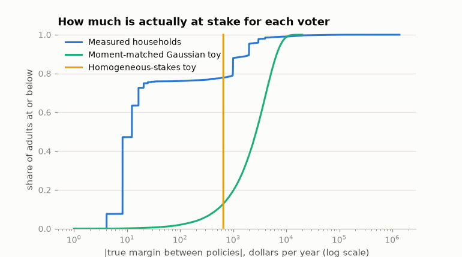

import DemocrasimExplorer from '../../components/DemocrasimExplorer.tsx';

A year ago I wrote a toy model of a question that bugs me: do elections
pick the policy that's better for people when voters misperceive what
policies would do to them? Every number in it was invented — abstract
"policy values," normal distributions, a placeholder welfare function.
This week I rebuilt it so that everything except perception is measured,
and the invented version turns out to have been wrong about almost
everything interesting.

The rebuilt model, [democrasim](https://github.com/MaxGhenis/democrasim),
works like this:

- **The electorate is 120,408 voting-age adults** from PolicyEngine's
  certified, population-calibrated microdata, representing 268 million
  people. (I co-founded PolicyEngine; this is a personal project using its
  open data and models.)
- **The two platforms are actual encoded reforms** with opposite
  incidence, labeled generically. Policy A raises the child tax credit's
  base amount from $2,200 to $3,200. Policy B caps the top two marginal
  income tax rates at 34%. The tax engine scores them at $39.1B and
  $38.0B a year of household net income — matched within 3% so neither is
  simply the bigger giveaway.
- **Each voter's true stake is engine-computed**: their household's
  change in annual net income under each policy, including knock-on
  effects through other taxes and benefits. A per-adult levy finances
  each policy, so both are budget-neutral and an inequality-averse
  welfare metric (log utility) ranks A above B.
- **Perception is the one assumption.** Each voter sees their own stake
  plus Gaussian noise σ, plus an optional shared bias. That's the knob
  the whole model turns on — and the thing a survey could measure but
  nobody has.

Then voters vote for whichever policy looks better for their household,
by plurality, and I ask how often the election picks the
welfare-preferred policy.

## What people actually have at stake

The invented model gave every voter a similar-sized stake. The measured
world looks nothing like that:

Gross of financing, 76% of adults see approximately $0 from both
policies. Policy A's gains arrive in per-child steps — $1,000, $2,000,
$3,000 — for the 20% of households with eligible children. Policy B
sends 99.7% of its dollars to the top income decile. And once financing
enters, the three-quarters with no direct stake inherit a margin of a
few dollars: the two levies differ by $4.10 per adult per year, so 75%
of adults have less than $25 a year riding on the outcome while a fifth
have more than $500.

That two-cliff shape — a nearly-indifferent mass of three in four, a
small bloc with thousand-dollar stakes — drives everything below.

## Try it

The model reduces to closed-form math (each voter votes A with
probability Φ((margin − bias)/σ√2)), so this runs the real thing in your
browser, on the real margins:

<DemocrasimExplorer client:load />

Three settings worth trying:

1. **Perfect information** (σ = $0). Policy B wins 100% of elections —
   the opposite of the welfare ranking. The 76% of adults whose entire
   stake is the $4.10 levy difference vote their four dollars, and
   together with the 3% who gain from the rate cap they outnumber the
   fifth of adults in households with children.
2. **Moderate noise** (σ = $1,000). Policy A wins essentially 100% of
   the time. Noise turns the four-dollar voters into coin flips that
   cancel, and the informed minority with per-child-sized stakes decides.
   In this regime, misperception helps.
3. **Shared bias** ($300 toward B, at the same σ = $1,000). The election
   flips back to B. About $221 per voter per year of shared misperception
   undoes what $1,000 of independent noise cannot touch.

## The knife-edge

The perfect-information result looks like "informed voters choose
badly," and that's not what it is. At σ = 0 the outcome is decided
entirely by the *sign* of the $1.1B residual cost gap between the two
policies — a byproduct of my choice to budget-match them within 3%,
with no connection to which policy the welfare metric prefers. Switch
the explorer to the counterfactual world where Policy B costs 3% more
instead of 3% less: perfect information now elects A every time, same
mechanism, opposite verdict. Perfect information doesn't make elections
anti-track welfare; it makes them welfare-independent, handing the
decision to whichever side of an arbitrary residual the no-stakes mass
lands on.

The mass only rules while it votes. In the gross world (no financing),
its stake is exactly $0, it abstains under the model's
indifference-abstains rule, and perfect information tracks perfectly on
24% turnout. A $25 abstention band does the same. Approval voting does
it too, from the other direction: voters who see both policies as small
net losses approve neither, and A wins at perfect information on 23%
turnout. Elections count people, not dollars — so whether the
trivial-stakes majority shows up decides everything, and that's a
behavioral question the model can't answer.

## Two corrections the toy model needed

**Thresholds are electorate-size statements.** The old model found "an
accuracy threshold" for elections to work. On measured stakes the
tracking window at 10,001 voters spans mean ranking accuracy 0.52 to
0.69 — but the entry point is pure Condorcet jury arithmetic, and it
falls toward 0.50 as the electorate grows (try the size selector). Only
the ceiling, where the knife-edge bites, survives at every scale. A
Gaussian world moment-matched to the real data never tracks at 10,001
voters and tracks with near-certainty at 268 million. Any claimed
threshold that doesn't state its n isn't a finding, it's a sample size.

**Noise and bias are different objects.** Independent misperception
averages out; shared misperception doesn't. The measured world shrugs
off $1,000-per-voter noise and flips on $221-per-voter bias — a fifth of
one per-child credit step. If you want to move this election, don't
make voters noisier; make them share a small error.

## What this is and isn't

This is a thought experiment about one mechanism: self-interested voting
on misperceived, engine-computed household impacts. Real voters weigh
values, identity, and much else; nothing here predicts elections. The
welfare ranking itself is a modeling choice — log utility with a $1,000
income floor ranks A first, and cranking inequality aversion to η ≥ 3
flips it — and both financed policies actually score below the status
quo, which plurality doesn't offer as a ballot option.

I also had four AI referees (two Claude, two Codex) review the work
before publishing; their reports and my responses are
[in the repo](https://github.com/MaxGhenis/democrasim/blob/main/docs/reviews/2026-07-11-referee-panel.md),
along with [the full findings note](https://github.com/MaxGhenis/democrasim/blob/main/docs/findings.md),
regeneration scripts for every number above, and tests that pin the
knife-edge facts so a future data update can't silently flip them.

The missing measurement is perception. The model can say what happens
*if* voters see their stakes with σ = $500 or a $200 shared bias; it
can't say where real voters sit. That's a survey — elicit what people
believe specific reforms would do to their own household, compute what
the tax engine says, and fit the gap
([democrasim#3](https://github.com/MaxGhenis/democrasim/issues/3)). The
model's answer will be one number on the axis you just dragged.
