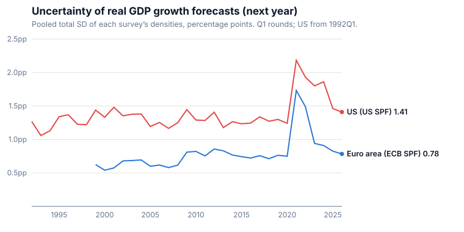
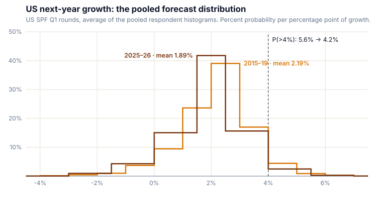

Since 1968 the [Survey of Professional Forecasters](https://www.philadelphiafed.org/surveys-and-data/real-time-data-research/survey-of-professional-forecasters) has asked its panel to spread probability across bins of US output growth, and since 1999 the [ECB has asked the same](https://www.ecb.europa.eu/stats/ecb_surveys/survey_of_professional_forecasters/html/index.en.html) of euro-area forecasters. Those histograms record what a point forecast cannot: how much confidence each forecaster puts behind the number. I pooled every one both surveys have published — nine variables, every horizon, 3,695 round-by-horizon groups — into a live tracker and two working papers of my own at [maxghenis.com/expectations](https://maxghenis.com/expectations/): a full paper on stated uncertainty across every variable and horizon, and a short note on growth expectations in the AI era.

*US forecasters state about twice the uncertainty euro-area forecasters do for next year's growth: a pooled standard deviation of 1.41 percentage points against 0.78 in the 2026Q1 rounds. Both spiked in the 2021Q1 rounds and have come most of the way back.*

  <a href="https://maxghenis.com/expectations/" style="display: inline-block; background: var(--accent); color: var(--ink, #0f172a); padding: 0.65rem 1.2rem; border-radius: var(--radius-md); font-weight: 600; text-decoration: none;">Explore the tracker &rarr;</a>
  <a href="https://maxghenis.com/expectations/paper/" style="font-weight: 600;">Read the working paper</a>

## Growth expectations in the AI era

US forecasters have marked growth down since COVID. In the five Q1 rounds of 2015–19, the pooled distribution for next year's real GDP growth centered on 2.19% and put 5.6% of its mass above 4%. In the two Q1 rounds of 2025 and 2026 it centers on 1.89% with 4.2% above 4% — two rounds against five, so treat the later window as a snapshot, not a trend. The ECB asks euro-area forecasters about growth four years out; they moved their center from 1.64% to 1.35% and raised the mass above 4% from 0.4% to 1.1%.

*The whole distribution moved, not only its mean. Both surveys draw a bin edge at exactly 4%, so the tail probabilities come straight off the reported histograms with no interpolation.*

The Forecasting Research Institute asked AI experts a question of the same form in 2025 ([Karger et al. 2026](https://forecastingresearch.org/research/economic-effects-of-ai)). Their pooled distribution, fitted to the quantiles the experts gave, put a chance that rounds to 0.0% on US growth averaging above 10% a year over 2025–29; when the institute asked them to assume rapid AI progress, they put 3.5%. A five-year average and the surveys' next-calendar-year growth measure different outcomes, so [my growth note](https://maxghenis.com/expectations/growth/paper/) lays out what each source asked — outcome, window, conditioning — and stops short of a matched comparison.

## What else the densities show

[My full paper](https://maxghenis.com/expectations/paper/) works through every density variable and horizon in both surveys, splitting each pooled distribution's variance into the average forecaster's own stated variance and the disagreement between forecasters.

- Disagreement, the spread between forecasters' means, accounts for a median 15% of total variance in US real GDP growth densities since 1992. The other 85% sits inside individual forecasters' histograms, where a disagreement index never looks.
- Next-year US growth, as the BEA now publishes it, landed inside the Q1 pooled ±1σ band in 22 of 33 target years. The misses come in streaks: 1996 through 2001, 2008–09, 2020–21, plus 2011.
- Stated uncertainty rises from the current year to the next and then stops: 1.32, 1.45, 1.52 and 1.52 percentage points at horizons of zero to three years, on average across the 2010–26 Q1 rounds. After a shock it inverts — in the 2021Q1 round, forecasters reported a wider distribution for 2021 than for 2023.
- Euro-area forecasters have reported the tighter distributions in every year both surveys overlap, including the 2020–21 spike.

## How I built it

The surveys print bins as "2.0 to 2.9", then "3.0 to 3.9"; I read each as running to the next bin's lower label, so that one covers 2 up to 3, spread each respondent's mass evenly within its bins, and close open tails at one adjacent-bin width. Reading the printed labels literally instead lowers each mean reported here by 0.05 points and leaves each comparison here unchanged. Every respondent gets equal weight, and the within/between split uses population variance, so the two parts add up to the pooled variance exactly in every one of the 3,695 groups. I score each density against the realized outcome with CRPS and compare it to expanding-window benchmarks built from target periods already complete at each round, using revised data. [A public repository](https://github.com/MaxGhenis/expectations) rebuilds everything — parsing, measures, scores, both manuscripts, the tracker — from the raw survey files, under an MIT license, with more than 200 tests, including a harness that runs the tracker page itself.
