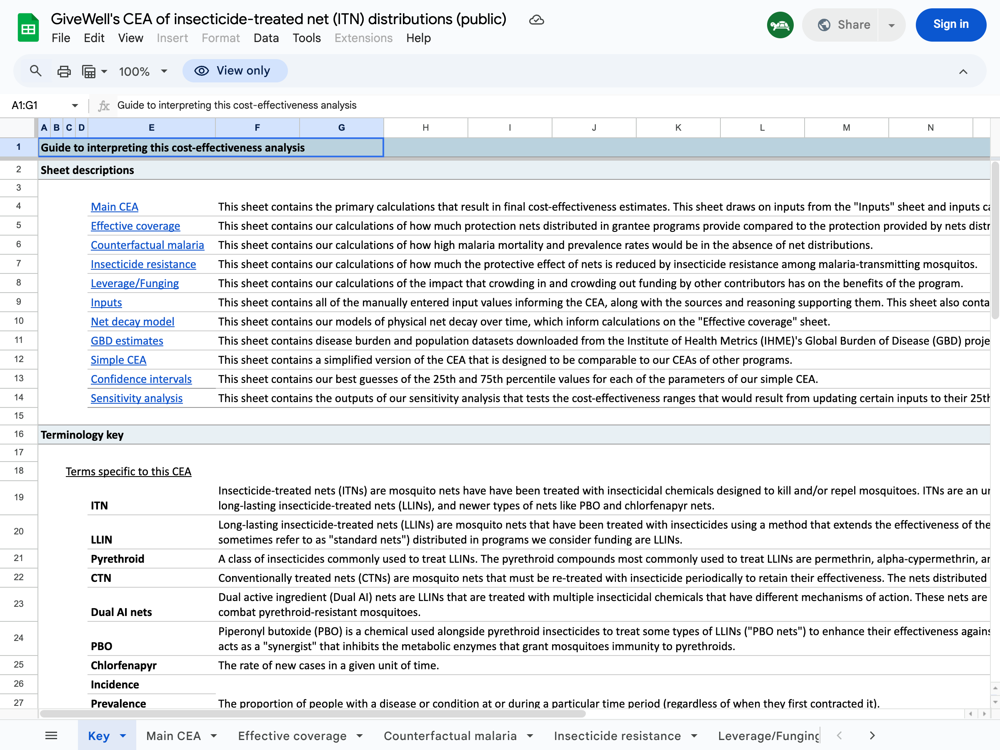

I re-implemented GiveWell's cost-effectiveness models for all six top charities as an open-source web tool: **[maxghenis.com/givewell-cea](https://maxghenis.com/givewell-cea)**

This post describes the replication, what I learned about GiveWell's methodology in the process, the verification results, and some observations about moral weight sensitivity. The tool itself lets you edit any parameter and immediately see the effect on charity rankings.

## Motivation

Others have done excellent work examining specific parts of GiveWell's CEA — [Froolow's critical review](https://forum.effectivealtruism.org/posts/6dtwkwBrHBGtc3xes/a-critical-review-of-givewell-s-2022-cost-effectiveness) of model architecture, [Nolan, Rokebrand, and Rao's uncertainty quantification](https://forum.effectivealtruism.org/posts/Nb2HnrqG4nkjCqmRg/quantifying-uncertainty-in-givewell-cost-effectiveness), and several pieces on [deworming](https://forum.effectivealtruism.org/posts/MKiqGvijAXfcBHCYJ/deworming-and-decay-replicating-givewell-s-cost) and [AMF](https://forum.effectivealtruism.org/posts/4Qdjkf8PatGBsBExK/adding-quantified-uncertainty-to-givewell-s-cost) uncertainty. But I couldn't find a tool that implements all six charities together and makes it easy to compare them while adjusting assumptions.

GiveWell's spreadsheets are powerful but hard to explore casually. Each charity has its own multi-tab workbook with dozens of sheets, specialized terminology, and cross-references between cells:



Changing a moral weight means editing cells across multiple sheets and comparing results manually. I wanted something where you could adjust one slider and immediately see how all six charities re-rank.

## What the model covers

For each charity I implemented the core pipeline from GiveWell's spreadsheets:

1. **People reached**: Grant size / cost per person reached
2. **Deaths averted** (or equivalent): People reached × mortality/disease rate × intervention effect size
3. **Units of value**: Deaths averted × moral weight (age-adjusted)
4. **Cost-effectiveness**: Units of value per dollar / benchmark value per dollar
5. **Adjustments**: Charity-level (quality, track record), intervention-level (external validity), leverage and funging

The six charities each have their own structure:
- **AMF** and **Malaria Consortium**: Under-5 mortality reduction, with separate pathways for older age mortality and developmental effects
- **Helen Keller International**: VAS effect on under-5 mortality
- **New Incentives**: Incremental vaccinations from cash incentives, converted to deaths averted using vaccine-specific effect sizes
- **GiveDirectly**: Consumption increase valued directly (no mortality pathway)
- **Deworm the World**: Long-run earnings effects of deworming, valued via ln(consumption)

All 51 charity/country combinations operate independently — each country has its own cost per person, mortality rate, adjustment factors, etc.

## Observations from the replication

A few things stood out:

**The benchmarks aren't on the same scale.** Each charity's cost-effectiveness is expressed as a multiple of GiveDirectly cash transfers. The denominator — how many "units of value" (GiveWell's composite of moral-weight-adjusted lives saved) one dollar of cash generates — differs across spreadsheets: AMF uses 0.00333, MC and HKI use 0.00335, and GiveDirectly uses 0.003. Different spreadsheets were built at different times with different moral weight calibrations baked in. GiveWell doesn't mechanically compare multiples across spreadsheets, but for a tool that displays them side by side, it's worth knowing the denominators aren't identical.

**Mortality rate definitions vary.** AMF's spreadsheet has both a raw malaria mortality rate and a derived "mortality rate in the absence of nets" rate. The latter accounts for existing net coverage and is the correct input. My first extraction accidentally used the raw rates, which underestimated AMF's cost-effectiveness by roughly 2x for some countries (e.g., DRC: 0.00306 raw vs. 0.00798 in-absence-of-nets).

**Counterfactual coverage drives most of the within-charity variation.** Both Helen Keller and New Incentives have a `proportionReachedCounterfactual` parameter — what fraction of people would receive the intervention anyway, without the charity's involvement. The remaining fraction is the charity's incremental impact. These tables show how this parameter (alongside cost, mortality rates, and adjustments) determines each location's cost-effectiveness:

Helen Keller (VAS):

| Country | Would receive VAS anyway | Incremental | x benchmark |
|---------|-------------------------|-------------|-------------|
| Niger | 15% | 85% | 79× |
| DRC | 20% | 80% | 30× |
| Mali | 21% | 79% | 17× |
| Madagascar | 33% | 67% | 12× |
| Guinea | 18% | 82% | 11× |
| Cameroon | 23% | 78% | 8× |
| Burkina Faso | 29% | 71% | 7× |
| Côte d'Ivoire | 40% | 60% | 6× |

New Incentives (vaccinations, Nigerian states):

| State | Would get vaccinated anyway | Incremental | x benchmark |
|-------|---------------------------|-------------|-------------|
| Sokoto | 68.5% | 31.5% | 39× |
| Zamfara | 79.4% | 20.6% | 31× |
| Kebbi | 71.9% | 28.1% | 29× |
| Bauchi | 81.5% | 18.5% | 20× |
| Jigawa | 85.8% | 14.2% | 18× |
| Katsina | 81.0% | 19.0% | 17× |
| Kano | 83.2% | 16.8% | 13× |
| Gombe | 88.0% | 12.0% | 10× |
| Kaduna | 84.2% | 15.8% | 9× |

The pattern is clear but imperfect — Niger's 85% incremental coverage is similar to Guinea's 82%, yet Niger scores 7x higher because its mortality rate is higher (1.4% vs 1.1%), VAS effect is double (11.1% vs 5.5%), and cost per child is 70% lower. The counterfactual sets the scale; the other parameters determine the multiplier within it.

**Helen Keller's leverage/funging adjustments need careful reading.** In my first pass, the funging adjustment for Burkina Faso extracted as 531.99 instead of -0.431. These values come from separate rows in the spreadsheet that are easy to confuse — a "percentage change" row vs. an "adjusted value" row.

## Verification

Parameters are extracted from GiveWell's November 2025 CEA spreadsheets ([AMF](https://docs.google.com/spreadsheets/d/1VEtie59TgRvZSEVjfG7qcKBKcQyJn8zO91Lau9YNqXc), [MC](https://docs.google.com/spreadsheets/d/1De3ZnT2Co5ts6Ccm9guWl8Ew31grzrZZwGfPtp-_t50), [HKI](https://docs.google.com/spreadsheets/d/1L6D1mf8AMKoUHrN0gBGiJjtstic4RvqLZCxXZ99kdnA), [NI](https://docs.google.com/spreadsheets/d/1mTKQuZRyVMie-K_KUppeCq7eBbXX15Of3jV7uo3z-PM)). I verified 46 of the 51 charity/country final cost-effectiveness multiples against the spreadsheets (GiveDirectly excluded — see Limitations):

| Charity | Countries | Max difference |
|---------|-----------|---------------|
| Against Malaria Foundation | 8 | <0.001% |
| Malaria Consortium | 8 | <0.001% |
| Helen Keller International | 8 | <0.001% |
| New Incentives | 9 | 0.000% (exact) |
| Deworm the World | 13 | 0.000% (exact) |

GiveDirectly uses older parameter extractions. 298 automated tests verify the calculations. The remaining <0.001% differences for AMF/MC/HKI are floating-point precision, not model discrepancies.

## Interactive features


**Calculation breakdown**: Click any country to see the step-by-step calculation with every intermediate value. Click any highlighted number to edit it.

**Moral weights**: GiveWell's default weights peak at ages 5-9 (134) and weight under-5 at 116. You can adjust these with a single multiplier or set each age bracket independently. Charities with different age profiles (AMF and MC focus on under-5; NI and HKI have broader age effects) shift rankings when you change these.

**Sensitivity analysis**: Sweep any moral weight parameter across its range and see how all six charities' cost-effectiveness changes. This makes crossover points visible — for instance, the under-5 weight where NI overtakes MC, or the discount rate at which deworming drops below cash transfers.

## How assumptions affect rankings

A few examples of what you see when you adjust parameters:

**Default rankings (best country per charity, GiveWell Nov 2025 defaults):**

| Rank | Charity | Best country | x benchmark |
|------|---------|-------------|-------------|
| 1 | Helen Keller | Niger | 79× |
| 2 | Deworm the World | Kenya | 35× |
| 3 | New Incentives | Sokoto | 39× |
| 4 | AMF | Guinea | 23× |
| 5 | Malaria Consortium | Chad | 15× |
| 6 | GiveDirectly* | Mozambique | 4× |

*GiveDirectly uses a simplified model with older parameters — see Limitations.

**Double the under-5 moral weight.** All four mortality-focused charities see exactly +100% gains — their value comes entirely from deaths averted, so doubling the weight doubles the result. GiveDirectly gains only +3.4% because its value comes from consumption benefits, not mortality. Rankings don't change.

**Equal moral weights across ages (all set to 100).** This reflects a view that a life saved is equally valuable at any age. It penalizes child-focused charities by 14-16% (since the default under-5 weight of ~116 drops to 100). Helen Keller drops from 79× to 67×. But rankings remain the same.

**Double AMF's cost per child in DRC.** The relationship is perfectly linear: doubling cost halves the x benchmark from 14.6× to 7.3×. This is a more powerful lever for changing *relative* rankings within mortality-focused charities than moral weight changes, which scale all of them equally.

When most top charities prevent child deaths, changing the weight on child deaths scales them all in the same direction. What *does* break the rankings is operational cost differences between countries. The tool lets you find the specific crossover points where, say, doubling a cost parameter in one country moves it below another charity entirely.

## Programmatic access

The models are pure TypeScript functions — no UI dependency. Clone the repo and run analyses directly:

```bash
git clone https://github.com/MaxGhenis/givewell-cea && cd givewell-cea
bun install
```

Sweep a parameter:

```typescript
// save as sweep.ts, run with: bunx tsx sweep.ts
import { calculateHelenKeller } from "./src/lib/models/helen-keller";
import { HK_COUNTRY_PARAMS } from "./src/lib/models/countries";

const niger = HK_COUNTRY_PARAMS.niger;
for (let effect = 0.05; effect <= 0.2; effect += 0.05) {
  const r = calculateHelenKeller({
    grantSize: 1_000_000,
    ...niger,
    vasEffect: effect,
  });
  console.log(`VAS effect ${(effect * 100).toFixed(0)}% → ${r.finalXBenchmark.toFixed(1)}×`);
}
// VAS effect 5%  → 35.6×
// VAS effect 10% → 71.3×
// VAS effect 15% → 106.9×
// VAS effect 20% → 142.5×
```

Rank all charity/country combinations:

```typescript
// save as rank.ts, run with: bunx tsx rank.ts
import { calculateHelenKeller } from "./src/lib/models/helen-keller";
import { calculateAMF } from "./src/lib/models/amf";
import { calculateNewIncentives } from "./src/lib/models/new-incentives";
import {
  HK_COUNTRY_PARAMS, HK_COUNTRY_NAMES,
  AMF_COUNTRY_PARAMS, AMF_COUNTRY_NAMES,
  NI_COUNTRY_PARAMS, NI_COUNTRY_NAMES,
} from "./src/lib/models/countries";

const G = 1_000_000;
const all = [
  ...Object.entries(AMF_COUNTRY_PARAMS).map(([k, v]) => ({
    charity: "AMF", country: AMF_COUNTRY_NAMES[k],
    xb: calculateAMF({ grantSize: G, ...v }).finalXBenchmark,
  })),
  ...Object.entries(HK_COUNTRY_PARAMS).map(([k, v]) => ({
    charity: "HKI", country: HK_COUNTRY_NAMES[k],
    xb: calculateHelenKeller({ grantSize: G, ...v }).finalXBenchmark,
  })),
  ...Object.entries(NI_COUNTRY_PARAMS).map(([k, v]) => ({
    charity: "NI", country: NI_COUNTRY_NAMES[k],
    xb: calculateNewIncentives({ grantSize: G, ...v }).finalXBenchmark,
  })),
];
all.sort((a, b) => b.xb - a.xb);
for (const r of all.slice(0, 10)) {
  console.log(`${r.charity.padEnd(4)} ${r.country.padEnd(16)} ${r.xb.toFixed(1)}×`);
}
// HKI  Niger            79.1×
// NI   Sokoto           38.6×
// NI   Zamfara          31.3×
// HKI  DRC              29.9×
// NI   Kebbi            29.0×
// AMF  Guinea           22.8×
// ...
```

Each model function (`calculateAMF`, `calculateHelenKeller`, `calculateNewIncentives`, etc.) takes a flat parameter object and returns all intermediate values, so you can inspect any step of the pipeline.

## Limitations

This replicates the *structure* of GiveWell's models but not their full analytical process. Specifically:

- I implement the calculation pipeline but not the reasoning behind parameter choices. GiveWell's adjustments (charity quality, external validity, leverage, funging) encode substantial judgment that this tool takes as given. The parameters themselves — particularly the adjustment factors — represent years of investigation, site visits, literature reviews, and internal debate. This tool lets you see the arithmetic, but the arithmetic was never the hard part.
- No uncertainty analysis. The tool shows point estimates only. [Several](https://forum.effectivealtruism.org/posts/4Qdjkf8PatGBsBExK/adding-quantified-uncertainty-to-givewell-s-cost) [excellent](https://forum.effectivealtruism.org/posts/ycLhq4Bmep8ssr4wR/quantifying-uncertainty-in-givewell-s-givedirectly-cost) [posts](https://forum.effectivealtruism.org/posts/Nb2HnrqG4nkjCqmRg/quantifying-uncertainty-in-givewell-cost-effectiveness) have explored what happens when you put distributions around these estimates.
- The GiveDirectly model is a simplified approximation based on an older spreadsheet and blog post, not a direct replication of GiveWell's current model. Its parameters (spillover effects, mortality effects, consumption persistence) are identical across all five countries, unlike GiveWell's country-differentiated approach.
- The tool currently covers GiveWell's top 6 charities but not newer additions.

For donation decisions, use [GiveWell's published estimates](https://www.givewell.org/how-we-work/our-criteria/cost-effectiveness/cost-effectiveness-models).

Source code: [github.com/MaxGhenis/givewell-cea](https://github.com/MaxGhenis/givewell-cea)
