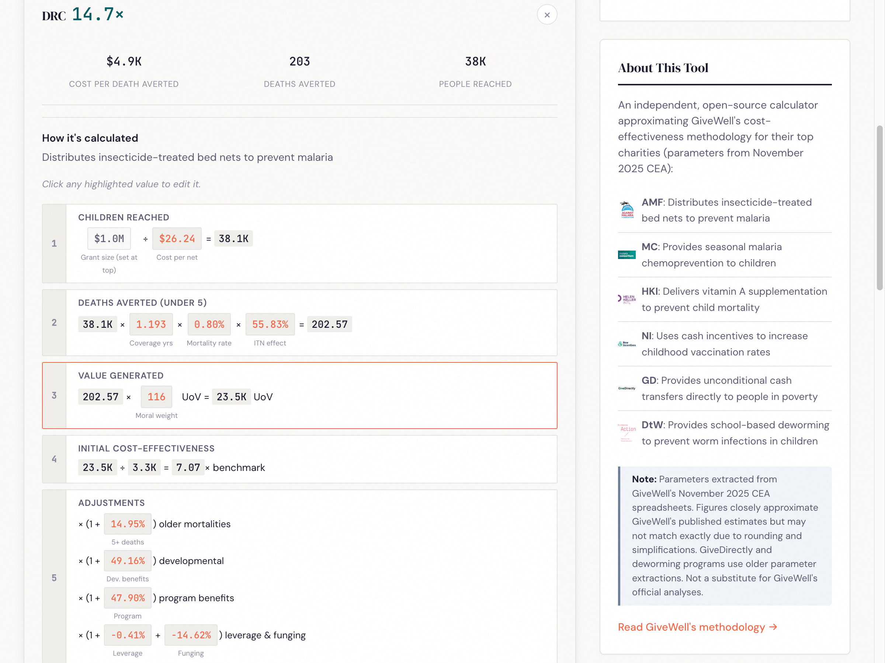

I re-implemented GiveWell's cost-effectiveness models for all six top charities as an open-source web tool: **[maxghenis.com/givewell-cea](https://maxghenis.com/givewell-cea)**

This post describes the replication, what I learned about GiveWell's methodology in the process, the verification results, and some observations about moral weight sensitivity. The tool itself lets you edit any parameter and immediately see the effect on charity rankings.

## Motivation

Others have done excellent work examining specific parts of GiveWell's CEA — [Joel's critical review](https://forum.effectivealtruism.org/posts/6dtwkwBrHBGtc3xes/a-critical-review-of-givewell-s-2022-cost-effectiveness) of model architecture, [GiveWell's own uncertainty work](https://forum.effectivealtruism.org/posts/Nb2HnrqG4nkjCqmRg/quantifying-uncertainty-in-givewell-cost-effectiveness), and several pieces on [deworming](https://forum.effectivealtruism.org/posts/MKiqGvijAXfcBHCYJ/deworming-and-decay-replicating-givewell-s-cost) and [AMF](https://forum.effectivealtruism.org/posts/4Qdjkf8PatGBsBExK/adding-quantified-uncertainty-to-givewell-s-cost) uncertainty. But I couldn't find a tool that implements all six charities together and makes it easy to compare them while adjusting assumptions.

GiveWell's spreadsheets are powerful but hard to explore casually. Each charity has its own multi-tab workbook. Changing a moral weight means editing cells across multiple sheets and comparing results manually. I wanted something where you could adjust one slider and immediately see how all six charities re-rank.

## What the model covers

For each charity I implemented the core pipeline from GiveWell's spreadsheets:

1. **People reached**: Grant size / cost per person reached
2. **Deaths averted** (or equivalent): People reached × mortality/disease rate × intervention effect size
3. **Units of value**: Deaths averted × moral weight (age-adjusted)
4. **Cost-effectiveness**: Units of value per dollar / benchmark value per dollar
5. **Adjustments**: Charity-level (quality, track record), intervention-level (external validity), leverage and funging

The six charities each have their own structure:
- **AMF** and **Malaria Consortium**: Under-5 mortality reduction, with separate pathways for older age mortality and developmental effects
- **Helen Keller International**: VAS effect on under-5 mortality
- **New Incentives**: Incremental vaccinations from cash incentives, converted to deaths averted using vaccine-specific effect sizes
- **GiveDirectly**: Consumption increase valued directly (no mortality pathway)
- **Deworm the World**: Long-run earnings effects of deworming, valued via ln(consumption)

All 46 charity/country combinations operate independently — each country has its own cost per person, mortality rate, adjustment factors, etc.

## Observations from the replication

A few things stood out:

**The benchmark matters more than you'd think.** AMF uses a benchmark of 0.00333 units of value per dollar, while MC and HKI use 0.0033545. This 0.75% difference in the denominator propagates directly to the final multiple. It took careful cell-tracing to realize different charities use slightly different benchmark constants — they're buried in separate sheets with different update cycles.

**Mortality rate definitions vary.** AMF's spreadsheet has both a raw malaria mortality rate and a derived "mortality rate in the absence of nets" rate. The latter accounts for existing net coverage and is the correct input. My first extraction accidentally used the raw rates, which underestimated AMF's cost-effectiveness by roughly 2x for some countries (e.g., DRC: 0.00306 raw vs. 0.00798 in-absence-of-nets).

**New Incentives' counterfactual coverage is the key driver.** The `proportionReachedCounterfactual` parameter (what fraction of children would get vaccinated anyway, without NI's incentives) varies dramatically by state — from 0.58 in Kano to 0.91 in Kaduna. This single parameter creates most of the 4x spread in NI's cost-effectiveness across Nigerian states. Getting this wrong (my first extraction had older values) produces large errors.

**Helen Keller's leverage/funging adjustments need careful reading.** In my first pass, the funging adjustment for Burkina Faso extracted as 531.99 instead of -0.431. These values come from separate rows in the spreadsheet that are easy to confuse — a "percentage change" row vs. an "adjusted value" row.

## Verification

Parameters are extracted from GiveWell's November 2025 CEA spreadsheets ([AMF](https://docs.google.com/spreadsheets/d/1VEtie59TgRvZSEVjfG7qcKBKcQyJn8zO91Lau9YNqXc), [MC](https://docs.google.com/spreadsheets/d/1De3ZnT2Co5ts6Ccm9guWl8Ew31grzrZZwGfPtp-_t50), [HKI](https://docs.google.com/spreadsheets/d/1L6D1mf8AMKoUHrN0gBGiJjtstic4RvqLZCxXZ99kdnA), [NI](https://docs.google.com/spreadsheets/d/1mTKQuZRyVMie-K_KUppeCq7eBbXX15Of3jV7uo3z-PM)). I verified all 46 charity/country final cost-effectiveness multiples against the spreadsheets:

| Charity | Countries | Max difference |
|---------|-----------|---------------|
| Against Malaria Foundation | 8 | <0.001% |
| Malaria Consortium | 8 | <0.001% |
| Helen Keller International | 8 | <0.001% |
| New Incentives | 9 | 0.000% (exact) |
| Deworm the World | 13 | 0.000% (exact) |

GiveDirectly uses older parameter extractions. 298 automated tests verify the calculations. The remaining <0.001% differences for AMF/MC/HKI are floating-point precision, not model discrepancies.

## Interactive features

**Calculation breakdown**: Click any country to see the step-by-step calculation with every intermediate value. Click any highlighted number to edit it.

**Moral weights**: GiveWell's default weights peak at ages 5-9 (134) and weight under-5 at 116. You can adjust these with a single multiplier or set each age bracket independently. Charities with different age profiles (AMF and MC focus on under-5; NI and HKI have broader age effects) shift rankings when you change these.

**Sensitivity analysis**: Sweep any moral weight parameter across its range and see how all six charities' cost-effectiveness changes. This makes crossover points visible — for instance, the under-5 weight where NI overtakes MC, or the discount rate at which deworming drops below cash transfers.

## How assumptions affect rankings

A few examples of what you see when you adjust parameters:

**Default rankings (best country per charity, GiveWell Nov 2025 defaults):**

| Rank | Charity | Best country | x benchmark |
|------|---------|-------------|-------------|
| 1 | Helen Keller | Niger | 79× |
| 2 | New Incentives | Sokoto | 39× |
| 3 | AMF | Guinea | 23× |
| 4 | Malaria Consortium | Chad | 15× |
| 5 | GiveDirectly | Mozambique | 4× |

**Double the under-5 moral weight.** All four mortality-focused charities see exactly +100% gains — their value comes entirely from deaths averted, so doubling the weight doubles the result. GiveDirectly gains only +3.4% because its value comes from consumption benefits, not mortality. Rankings don't change.

**Equal moral weights across ages (all set to 100).** This reflects a view that a life saved is equally valuable at any age. It penalizes child-focused charities by 14-16% (since the default under-5 weight of ~116 drops to 100). Helen Keller drops from 79× to 67×. But rankings remain the same.

**Double AMF's cost per child in DRC.** The relationship is perfectly linear: doubling cost halves the x benchmark from 14.6× to 7.3×. This is a more powerful lever for changing *relative* rankings within mortality-focused charities than moral weight changes, which scale all of them equally.

The main takeaway: rankings are remarkably stable to moral weight changes because the top charities all work through similar mortality-reduction mechanisms. Operational cost differences between countries create much more variation than ethical assumptions.

## Limitations

This replicates the *structure* of GiveWell's models but not their full analytical process. Specifically:

- I implement the calculation pipeline but not the reasoning behind parameter choices. GiveWell's adjustments (charity quality, external validity, leverage, funging) encode substantial judgment that this tool takes as given.
- No uncertainty analysis. The tool shows point estimates only. [Several](https://forum.effectivealtruism.org/posts/4Qdjkf8PatGBsBExK/adding-quantified-uncertainty-to-givewell-s-cost) [excellent](https://forum.effectivealtruism.org/posts/ycLhq4Bmep8ssr4wR/quantifying-uncertainty-in-givewell-s-givedirectly-cost) [posts](https://forum.effectivealtruism.org/posts/Nb2HnrqG4nkjCqmRg/quantifying-uncertainty-in-givewell-cost-effectiveness) have explored what happens when you put distributions around these estimates.
- The tool currently covers GiveWell's top 6 charities but not newer additions.
- GiveDirectly and deworming use older parameter extractions.

For donation decisions, use [GiveWell's published estimates](https://www.givewell.org/how-we-work/our-criteria/cost-effectiveness/cost-effectiveness-models).

Source code: [github.com/MaxGhenis/givewell-cea](https://github.com/MaxGhenis/givewell-cea)
