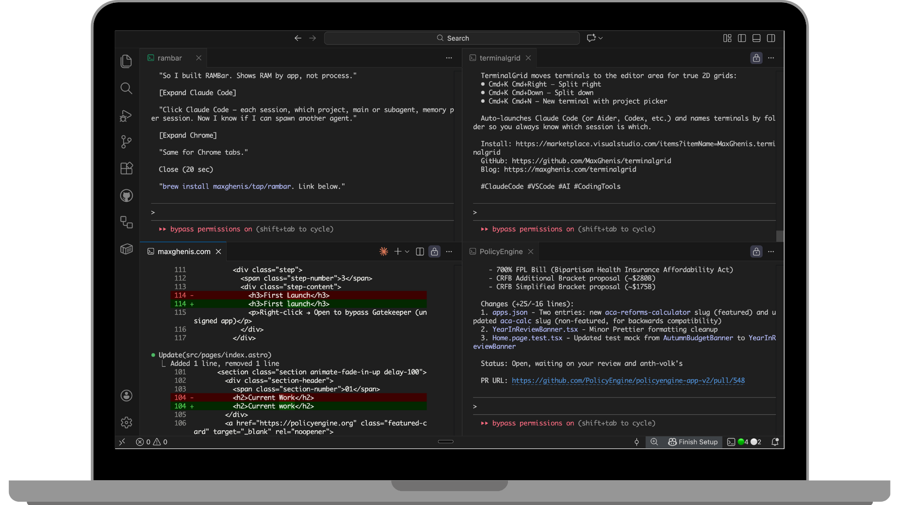

import AICodingTimeline from '../../components/AICodingTimeline.astro';

Claude Code creator Boris Cherny [recently shared](https://x.com/bcherny/status/2004897269674639461) that since the beginning of December, "100% of my contributions to Claude Code were written by Claude Code." He elaborated: "In the last thirty days, I landed 259 PRs—497 commits, 40k lines added, 38k lines removed. Every single line was written by Claude Code + Opus 4.5."

I've been building entirely in Claude Code since October—longer than Boris because he's a much better developer than I am, so Claude didn't have to be as good. My VS Code is just a shell for Claude Code terminals. It's why I created the [TerminalGrid extension](https://maxghenis.com/terminalgrid)—I haven't used the file editor in months.

The next step in this evolution is to skip the IDE altogether. And 2025's tool launches suggest that's exactly where the industry is heading.

<AICodingTimeline />

The Claude Desktop approach differs from Codex and similar cloud tools in one crucial way: full local access. Claude Code can run any shell command, access your filesystem, and control your browser. Cloud-based agents like Codex run in sandboxed containers with restricted permissions. Claude's bet is that developers want an agent with the same access they have—not a constrained PR-generator.

## The paradigm shift

Google's Antigravity documentation articulates what's happening: the shift from "Editor view" (traditional IDE interface with an agent sidebar) to "Manager view" (orchestrating autonomous agents).

In Manager view, you don't write code—you describe what you want, the agents work in parallel, and you review artifacts (task lists, implementation plans, screenshots, browser recordings). It's project management, not programming.

This matches how I've been working—I typically run 5-10 Claude Code sessions simultaneously through [TerminalGrid](/terminalgrid), spread across a 2x2 grid (sometimes with multiple tabs per cell, sometimes across two VS Code windows):

Boris Cherny [described a similar setup](https://venturebeat.com/technology/the-creator-of-claude-code-just-revealed-his-workflow-and-developers-are): "I run 5 Claudes in parallel in my terminal. I number my tabs 1-5, and use system notifications to know when a Claude needs input." He also runs 5-10 instances on claude.ai, using a "teleport" command to hand off sessions between web and terminal.

## Why I'm not quite there yet

This week I've been experimenting with Claude Code in Desktop, and while it's close to replacing VS Code, I've hit two blocking issues:

1. **No MCP support yet**: Claude Code in the Desktop app doesn't support MCP servers, so I can't use browser automation tools like Claude in Chrome. The same MCPs work fine in VS Code's terminal and in non-Code Claude Desktop. I [posted about this](https://x.com/MaxGhenis/status/2009808936212549910)—a Claude Code engineer [replied](https://x.com/amorriscode/status/2010410355030421700) that MCP support should come next week.

2. **Sessions drop when switching accounts**: I run out of quota on my Claude Max 20x account regularly (those 5 parallel Claude instances add up), so I maintain two accounts. Claude Desktop drops sessions when I switch between them, losing context.

## The bigger picture

[As of late 2025](https://blog.jetbrains.com/research/2025/10/state-of-developer-ecosystem-2025/), roughly 85% of developers regularly use AI tools for coding. [Stack Overflow's 2025 Developer Survey](https://survey.stackoverflow.co/2025/) found 65% use them weekly. The question isn't whether AI will change how we code—it's whether we'll still call what we do "coding" at all.

Boris Cherny's workflow hints at the answer. He doesn't code. He orchestrates agents. He described using Opus 4.5 for everything because "even though it's bigger & slower than Sonnet, since you have to steer it less and it's better at tool use, it is almost always faster than using a smaller model in the end."

That's the trade-off: more capable models need less human steering, which means less time in the editor, which means the editor matters less.

## What happens next

I expect Anthropic to fix both blocking issues this month. When they do, I'll switch from VS Code to Claude Desktop, and TerminalGrid will join the graveyard of tools I've built that AI capabilities have rendered obsolete.

[CodeStitch](https://codestitch.dev), which I built in mid-2024 to paste codebases into Claude's context window, was obsolete within months of Claude Code maturing. TerminalGrid solved a real problem for exactly the window between "Claude Code exists" and "Claude Code has a native manager interface." That window is closing.

The pattern for developer tooling: ship fast, solve the problem in front of you, expect obsolescence. Frontier labs are moving so quickly on general-purpose dev tools that anything built to improve them has a short shelf life.

But that's fine. Disposable tools can accelerate progress toward bigger challenges. The real opportunity isn't building better coding tools—it's applying AI to problems that matter. Health, poverty, governance, the environment. If you can ship in days what used to take months, you can tackle problems that were previously out of reach.

When Claude Desktop works reliably, I'll abandon my TerminalGridded IDE without looking back—and get back to the real work.
