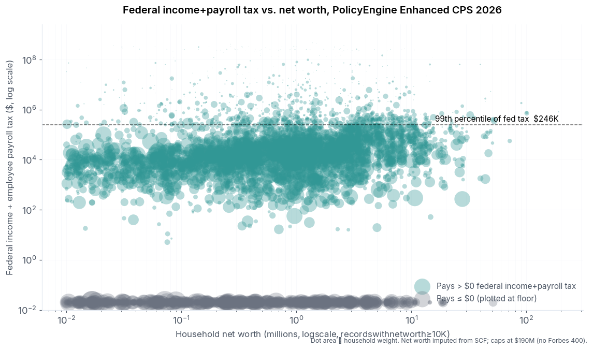

On this week's [Ezra Klein Show](https://www.nytimes.com/2026/04/17/opinion/ezra-klein-podcast-ray-madoff.html), Boston College tax law professor Ray Madoff said:

> When it comes to the wealthiest Americans — Zuckerberg, Bezos, Musk, Larry Ellison, all the people we hear about so often — they are just as likely to be in the 40 percent of nonpayers as they are in the top 1 percent of payers.

Madoff's claim is about federal income tax (the measure the "40% of nonpayers" statistic describes). Everything below uses that same denominator.

The top 1% by AGI starts at $663,164 for TY2022 ([IRS via Tax Foundation](https://taxfoundation.org/data/all/federal/latest-federal-income-tax-data-2025/)). The top 1% by federal income tax paid has a higher threshold — household-level it's $185,608 in PolicyEngine's 2026 microdata (below).

## The dividend-driven tax floor

For the specific people Madoff named, the question isn't whether they *could* be nonpayers in theory. It's whether their documented income flows leave room to. Recent dividend initiations at their companies provide unavoidable taxable income. Verified figures:

| Person | Stake | Annual dividend income | Federal income tax on dividends (≈ 23.8%) |
|---|---|---|---|
| Larry Ellison | 1.16B Oracle shares (40%+) at [$2.00/share](https://www.marketbeat.com/stocks/NYSE/ORCL/dividend/) | **~$2.3B** | ~$552M |
| Steve Ballmer | 333M Microsoft shares at ~$3.24/share | **~$1.08B** ([247wallst](https://247wallst.com/investing/2025/06/11/steve-ballmer-makes-1-billion-a-year-in-microsoft-dividends/)) | ~$257M |
| Mark Zuckerberg | ~350M Meta shares at $2.10/share (initiated 2024) | **~$735M** ([Bloomberg](https://www.bloomberg.com/news/articles/2024-02-02/zuckerberg-to-get-700-million-a-year-from-meta-s-new-dividend)) | ~$175M |
| Sergey Brin | 730M Alphabet shares at $0.80/share (initiated 2024) | **~$584M** | ~$139M |
| Larry Page | 389M Alphabet shares at $0.80/share | **~$311M** ([CNBC](https://www.cnbc.com/2024/04/25/alphabet-issues-first-ever-dividend-70-billion-buyback.html)) | ~$74M |

Every one of these five is mechanically locked into a federal income tax bill in the **tens to hundreds of millions** every year, from dividends alone, before any stock sale or compensation. The top-1%-of-payers threshold ($186K) is cleared by a factor of 400–3,000x. None of them can land in the "$1 – $186K" middle bin from these flows.

For the three centibillionaires whose companies don't pay a dividend — Bezos (Amazon), Musk (Tesla), and pre-2024 Page/Brin (Alphabet) — the tax floor instead comes from discretionary sales. Bezos has sold $8–10B of Amazon annually since 2020, generating roughly $2B/year in federal tax. Musk exercised expiring Tesla options in 2021 and paid [$11B](https://www.cnn.com/2021/12/29/investing/elon-musk-tesla-stock-sales/index.html). In years with no such realization event, these three can in principle land at $0 — which ProPublica documented for Bezos in 2007 and 2011, and for Musk in 2018.

So the centibillionaire distribution in a given year is close to binary: either hundreds of millions in federal income tax (dividend-paying stake or active sales) or $0 (pure buy-borrow-die year). The $1–$186K middle is essentially empty at this wealth scale.

## Per-person data disclosed by ProPublica

Year-by-year federal income tax for the people [ProPublica](https://www.propublica.org/article/the-secret-irs-files-trove-of-never-before-seen-records-reveal-how-the-wealthiest-avoid-income-tax) named with dollar figures. The leak window is 2014–2018 unless noted.

| Person | $0 years in 2014–2018 | $0 years outside the window | Non-$0 tax disclosed |
|---|---|---|---|
| Warren Buffett | 0 | — | $23.7M total, 2014–2018 |
| Jeff Bezos | 0 | 2007, 2011 | $973M total, 2014–2018 |
| Michael Bloomberg | "several" (count not disclosed) | — | $292M total, 2014–2018; $70.7M in 2018 |
| Elon Musk | 2018 | — | $455M total, 2014–2018; $11B in 2021 |
| Mark Zuckerberg | 0 | — | hundreds of millions/yr via 10b5-1 |
| Larry Ellison | 0 | — | Oracle dividend every year |
| Carl Icahn | 2016, 2017 | — | $544M AGI across those years, $0 tax via interest expense |
| George Soros | 2016, 2017, 2018 | — | other years not disclosed |

In the 2014–2018 window: ≥6 zero years (Musk 1, Icahn 2, Soros 3, Bloomberg ≥1 unspecified) across 40 person-years, i.e. **≥15%**. Adding Bezos's out-of-window 2007 and 2011 zeros is 8+ documented zero years across the broader ProPublica coverage. Half of the eight named people had at least one documented zero year; half had none.

**Extrapolation to the top 100 wealthiest over the past decade is an estimate.** Starting from the ~15% in-window disclosed rate and adjusting for the Forbes 400 containing more hedge-fund and private-equity profiles (Icahn/Soros-style loss or deduction years) than the few names ProPublica covered in detail, a plausible range is **5–15%** per-year zero rate. This is a Claude estimate, not a published number — the underlying data isn't public.

Against Madoff's claim, the meaningful comparison is:

- Random US household in a given year: 40–44% pay $0 federal income tax ([TPC](https://taxpolicycenter.org/briefing-book/who-doesnt-pay-federal-income-taxes); 43.9% in PolicyEngine's 2026 file below), ~1% are in the top 1% of payers. Ratio nonpayer : top-1%-payer = **~40 : 1**.
- Top 100 wealthiest in a given year: 5–15% estimated zero rate; top-1%-of-payers rate not directly measured but most years' disclosed tax bills for Bezos, Musk, Bloomberg, and Zuckerberg put them well past the top-1% threshold. Directionally the ratio is inverted from the population.

## What the microdata says

[PolicyEngine's Enhanced CPS](https://policyengine.github.io/policyengine-us/) imputes household net worth from the Federal Reserve's Survey of Consumer Finances. The 99th percentile of federal income tax at the household level is $185,608 in the 2026 file (script: [gist](https://gist.github.com/MaxGhenis/3f10cc98b643e0a76e74eae9afe35082)):

| Wealthiest N households | Records | Net-worth range | Top 1% of income-tax payers | Pay $0 |
|---|---|---|---|---|
| Top 100 | 2 | $100.6M – $190.3M | 100.0% | 0.0% |
| Top 1,000 | 2 | $100.6M – $190.3M | 100.0% | 0.0% |
| Top 10,000 | 7 | $51.3M – $190.3M | 78.1% | 10.3% |
| Top 100,000 | 27 | $30.2M – $190.3M | 21.5% | 50.5% |
| Top 1,000,000 | 135 | $13.4M – $190.3M | 4.2% | 34.0% |
| All US households | 6,876 | — | 1.0% | 43.9% |

"Records" is the number of underlying microdata households contributing to each weighted group. The top 100 and top 1,000 both come from the same 2 records, so the 100.0% and 0.0% point estimates have no meaningful precision at that end — they're saying "the two synthetic records at the top of the file both clear the threshold and both have positive tax." The top-10,000 and top-100,000 rows are based on more records and are more informative about the $30M–$190M range.

Net worth in Enhanced CPS is imputed from the [Survey of Consumer Finances](https://www.federalreserve.gov/econres/scfindex.htm), which excludes Forbes 400-style respondents by design and truncates the upper tail at around $190M. The Forbes 400 uses direct estimates of billionaire wealth and isn't integrated into the SCF or into PE's microdata. So the microdata can't directly test Madoff's claim for Zuckerberg, Bezos, Musk, or Ellison — only for the visible $30M–$190M range.

Within that range, the top-100,000 row is notable: 50.5% pay $0 federal income tax, higher than the 43.9% population baseline. These are wealth-holders whose wealth is concentrated in housing, retirement accounts, or unrealized stock gains, with little realized annual income. This is the wealth profile that comes closest to matching Madoff's framing — but it's an order of magnitude less wealthy than Forbes 400 territory, and the share of nonpayers drops toward zero as you move further up the wealth ladder in the file.

Binned by net worth:

Sample size per bin is printed below each point. The $100M+ bin is based on only 3 records, so the 100% / 0% point there reflects the sparse top of the file, not a robust estimate.

## Other estimates of what the wealthiest pay

The rate you get for the top of the distribution depends on the denominator:

- **Tax / reported AGI.** For the Forbes 400, ProPublica's [top-400 interactive table](https://projects.propublica.org/americas-highest-incomes-and-taxes-revealed/) lists individual effective federal income tax rates averaged 2013–2018; most are in the 17–24% range.
- **Tax / (AGI + untaxed corporate profits).** [Saez, Yagan, Zucman et al. (NBER w34170, 2025)](https://www.nber.org/papers/w34170) put the top 0.0002% total federal rate at 24% for 2018–2020, vs. 30% population-wide. [Splinter's reanalysis](https://www.davidsplinter.com/BillionaireTaxRate.pdf) adjusts for multi-return Forbes families and different corporate-tax imputation and arrives at 38% — above the population average.
- **Tax / comprehensive income including unrealized capital gains.** The [OMB/CEA 2021 analysis](https://www.whitehouse.gov/cea/written-materials/2021/09/23/what-is-the-average-federal-individual-income-tax-rate-on-the-wealthiest-americans/) put the top 400 at 8.2%. ProPublica's 3.4% "true tax rate" divides tax paid by change in net worth over the period.

None of these studies — including ProPublica's follow-ups in the [Secret IRS Files series](https://www.propublica.org/series/the-secret-irs-files) — report the share of centibillionaire person-years with $0 federal income tax, because per-person year-by-year data isn't public. The question Madoff's framing depends on isn't directly measured in the published literature.

## Rate vs. frequency

Two of the three rate methodologies (ProPublica 3.4%, OMB/CEA 8.2%, Saez-Zucman 24%) put the richest below the 30% population average; Splinter's 38% recalculation is above. The rate story is more contested than a single headline number suggests.

The frequency framing — "just as likely to be in the 40% of nonpayers as the top 1% of payers" — is a different question. For the US population, the ratio (nonpayer year : top-1%-payer year) is ~44:1 in 2026. For the ~14 US centibillionaires Madoff named examples from, combining the dividend-driven tax floor above with ProPublica's ~10% documented zero-year rate gives a distribution roughly like:

- ~85–90% in the top 1% of payers
- ~10–15% nonpayers
- ~0% in the $1–$186K middle (no realization pattern at $100B+ net worth produces tax in that narrow band)

The ratio is inverted from the population: roughly 1:8 in favor of top-1%-of-payers, not Madoff's implied 1:1.
